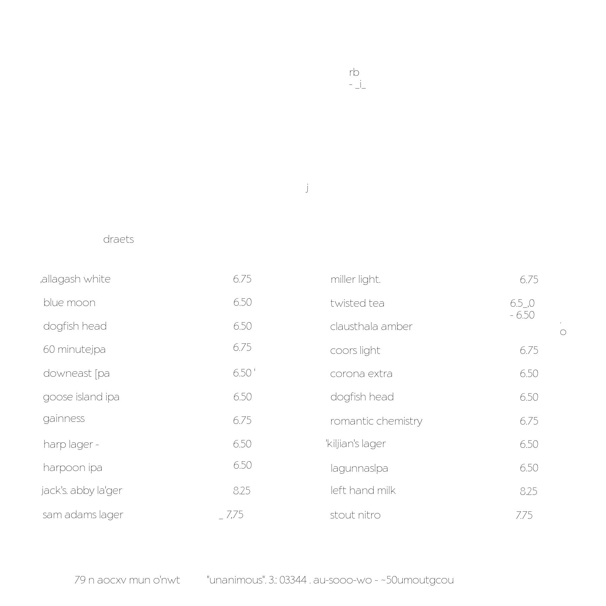
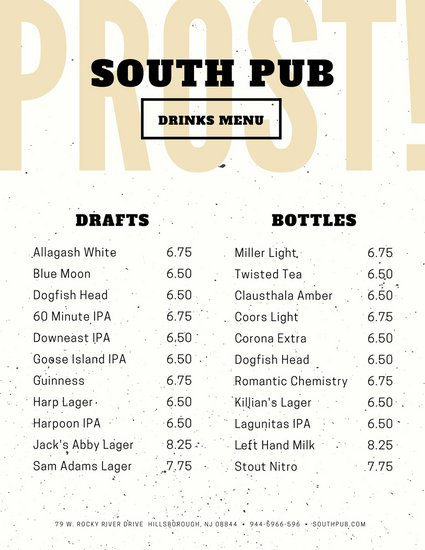

# image_text_reader
[](https://gitter.im/yardstick17/image_text_reader?utm_source=badge&utm_medium=badge&utm_campaign=pr-badge) [](https://travis-ci.org/yardstick17/image_text_reader)

It's a very basic tool to read images , images formatted like a restaurant-menu.

### Tesseract-ocr
This tools need tesseract-ocr engine. Help yourself with this --
* https://github.com/tesseract-ocr/tesseract/wiki

###### OCR reads the text extracted image from the full image. [Click here](https://github.com/yardstick17/menu_parser/blob/master/boxed_image.jpg)

## Command to use:

### Dockerized image reading
> docker run -it yardstick17/image-text-reader bash -c "PYTHONPATH='.' python3 read_image.py read_text_from_local_image -f images/sample_image.jpg"

### Read from url

> PYTHONPATH='.' python3 read_image.py read_text_from_image_url -u https://marketplace.canva.com/MACHUlPU93Q/1/0/thumbnail_large/canva-peach-green-leaves-garden-vegetarian-pizza-menu-MACHUlPU93Q.jpg

```bash
[2017-07-07 16:20:34,119] INFO : Downloading image from url: https://marketplace.canva.com/MACHUlPU93Q/1/0/thumbnail_large/canva-peach-green-leaves-garden-vegeta
[2017-07-07 16:20:35,997] INFO : Saving file: /var/folders/cz/n3vkz7x91qs06nmm9byxxgz00000gr/T/tmpienrxu2c
[2017-07-07 16:20:35,997] INFO : Processing image for text Extraction
[2017-07-07 16:20:36,308] INFO : Removing noise and smoothening image
[2017-07-07 16:20:36,431] INFO : Reading the text inside the contour plotted
```


### Read from local image
> PYTHONPATH='.' python3 read_image.py read_text_from_local_image -f images/sample_image.jpg
```bash
[2017-07-07 16:32:38,862] INFO : Processing image for text Extraction
[2017-07-07 16:32:39,232] INFO : Removing noise and smoothening image
[2017-07-07 16:32:39,442] INFO : Reading the text inside the contour plotted
```


### Deploy an api for reading text from image!
> PYTHONPATH='.' python3 api/app.py
```bash
[2017-07-07 16:49:57,818] INFO :  * Running on http://0.0.0.0:6600/ (Press CTRL+C to quit)
[2017-07-07 16:49:57,820] INFO :  * Restarting with stat
[2017-07-07 16:49:58,712] WARNING :  * Debugger is active!
[2017-07-07 16:49:58,738] INFO :  * Debugger pin code: 316-405-633
```

### Sample api deployed on my tiny server. Please be patient with them.
```bash
curl -X POST \
  http://54.254.214.96/read_image_from_file/url \
  -F url=https://africatalentbank.com/wp-content/uploads/2014/10/Menu.jpg
```

### Digital Menu


### Original Image

